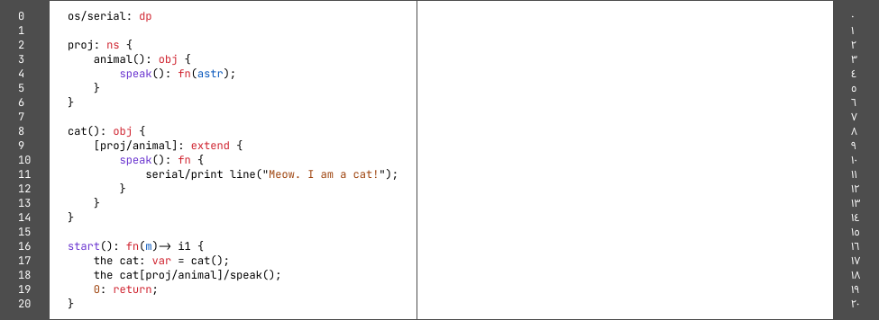

# x7cF Clarity Programming Language

- Requires the nightly version of the Rust programming language tools to compile.
- Currently, in heavy development
- Parser type: Recursive Decent
- Tree Based Name Lookup: Yes